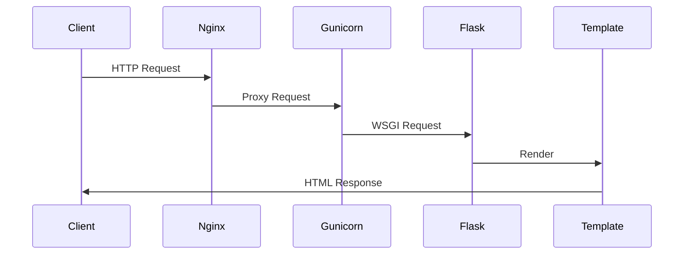
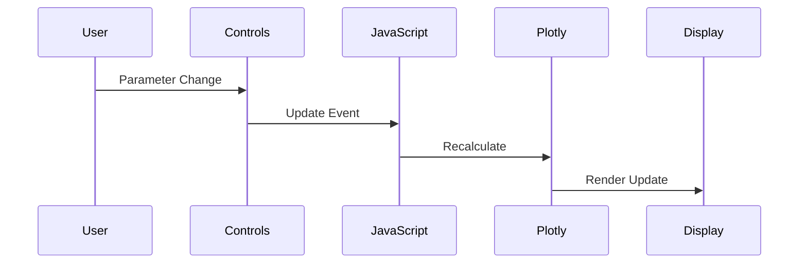

# Technical Architecture Documentation

## System Overview

### Technology Stack
- **Backend**: Python Flask
- **Frontend**: HTML5, CSS3, JavaScript
- **Visualization**: Plotly.js, Three.js
- **Mathematics**: Custom implementations
- **Deployment**: Docker containerization

### Architecture Diagram
```
[Client Browser]
     ↕ HTTP/WebSocket
[Nginx Reverse Proxy]
     ↕ WSGI
[Gunicorn WSGI Server]
     ↕ 
[Flask Application]
     ↕
[Python Backend Services]
```

## Component Architecture

### 1. Frontend Layer

#### Core Components
- **HTML Templates**: Jinja2-based templating
- **CSS Styling**: Modern CSS with variables
- **JavaScript Modules**: Modular visualization code
- **Interactive Controls**: Real-time parameter adjustment
- **Responsive Design**: Mobile-first approach

#### Visualization Components
1. **Oscillator Module**
   - Complex wave function visualization
   - Interactive parameter controls
   - Real-time animation system

2. **Evolution Module**
   - Topology optimization visualization
   - Compatibility analysis display
   - Progress tracking interface

3. **Maxwell Module**
   - Statistical distribution plots
   - Particle velocity visualization
   - Temperature dependence display

4. **Maxwell's Equations Module**
   - Electromagnetic field visualization
   - Wave propagation animation
   - Field interaction display

### 2. Backend Layer

#### Flask Application
- Route handling
- Template rendering
- Static file serving
- API endpoints

#### Python Services
- Mathematical computations
- Data processing
- State management
- Error handling

### 3. Infrastructure

#### Docker Configuration
```dockerfile
FROM python:3.9-slim

# Set working directory
WORKDIR /app

# Update pip and setuptools
RUN pip install --no-cache-dir --upgrade pip setuptools>=70.0.0

# Install dependencies
COPY requirements.txt .
RUN pip install --no-cache-dir -r requirements.txt

# Copy application files
COPY app.py .
COPY skb_visualization.py .
COPY templates templates/
COPY static static/

# Expose port
EXPOSE 5000

# Set environment variables
ENV PYTHONUNBUFFERED=1
ENV FLASK_APP=app.py

# Run with Gunicorn
CMD ["gunicorn", "--bind", "0.0.0.0:5000", "--workers", "2", "--timeout", "120", "app:app"]
```

#### Development Environment
- VS Code configuration
- Debugging setup
- Linting rules
- Testing framework

## Data Flow

### 1. Request Handling


### 2. Visualization Updates


## Security Considerations

### 1. Input Validation
- Parameter range checking
- Type validation
- Sanitization of user inputs

### 2. Error Handling
- Graceful degradation
- User-friendly error messages
- Detailed logging

### 3. Resource Management
- Memory usage optimization
- CPU load balancing
- Cache management

## Performance Optimization

### 1. Frontend
- Code splitting
- Lazy loading
- Asset optimization
- Cache strategies

### 2. Backend
- Request caching
- Computation optimization
- Database indexing
- Connection pooling

### 3. Network
- Content compression
- CDN integration
- HTTP/2 support
- WebSocket efficiency

## Deployment Process

### 1. Build Pipeline
```bash
# Build Docker image
docker build -t 4d-manifold-explorer .

# Run container
docker run -d -p 5000:5000 4d-manifold-explorer
```

### 2. Testing Strategy
- Unit tests
- Integration tests
- End-to-end tests
- Performance testing

### 3. Monitoring
- Error tracking
- Performance metrics
- Usage analytics
- Health checks

## Development Guidelines

### 1. Code Style
- PEP 8 for Python
- ESLint for JavaScript
- CSS naming conventions
- Documentation standards

### 2. Version Control
- Git workflow
- Branch naming
- Commit messages
- Code review process

### 3. Documentation
- Code comments
- API documentation
- User guides
- Architecture updates

## Future Considerations

### 1. Scalability
- Horizontal scaling
- Load balancing
- Database sharding
- Caching layers

### 2. New Features
- Additional visualizations
- Real-time collaboration
- Data export options
- API integrations

### 3. Maintenance
- Dependency updates
- Security patches
- Performance monitoring
- User feedback integration 